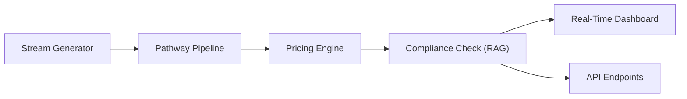

# Real-Time Intelligent Pricing Insight System

This project demonstrates a real-time AI-driven pricing system that continuously updates prices based on live demand and market signals using **Pathway's streaming data pipeline**. It combines machine learning for price optimization with a RAG (Retrieval-Augmented Generation) layer for policy compliance.

## Architecture Overview

1.  **Streaming Data Generator**: Simulates live market signals (demand, stock, competitor prices).
2.  **Pathway Pipeline**: Ingests the live stream, computes optimal prices using an online model, and runs RAG-based policy checks.
3.  **Pricing Engine**: A modular core that evaluates candidate prices against business targets and compliance rules.
4.  **Real-Time Dashboard**: A Streamlit interface that visualizes price changes and policy violations as they happen.



## Setup Instructions

1.  **Clone the Repository**
    ```bash
    git clone https://github.com/Taniiie/DynamicPricingEngine.git
    cd DynamicPricingEngine
    ```

2.  **Create Virtual Environment & Install Dependencies**
    ```bash
    python -m venv venv
    venv\Scripts\activate  # Windows
    pip install -r requirements.txt
    ```

3.  **Configure Environment**
    - Copy `.env.example` to `.env`
    - Add your `OPENAI_API_KEY` for full RAG functionality (optional, fallback provided).

4.  **Run the Streaming Pipeline**
    - **Step 1: Start the Stream Generator**
      ```bash
      python pipeline/stream_generator.py
      ```
    - **Step 2: Start the Pipeline Runner**
      ```bash
      python pipeline/pipeline_runner.py
      ```
    - **Step 3: Launch the Dashboard**
      ```bash
      streamlit run app.py
      ```

## Real-Time Streaming Functionality

The system simulates live data ingestion by streaming market data at 2-second intervals. Each new data point triggers an immediate price recalculation in the **Pathway** pipeline.

-   **Latency**: Designed for sub-second processing of events.
-   **Dynamism**: Changes in competitor prices or sudden demand spikes are reflected instantly in the recommended price.
-   **Transparency**: Every decision is accompanied by an explanation generated by the RAG layer, citing relevant pricing policies.

## Key Features

-   **Streaming AI**: Uses Pathway to process data on the fly.
-   **Policy Guard**: RAG-based system ensures all price changes comply with business rules.
-   **Interactive Agent**: Ask questions about pricing decisions via the built-in AI assistant.
